<div align="center">
<picture>
  <source media="(prefers-color-scheme: dark)" srcset="./assets/hero.svg" />
  <source media="(prefers-color-scheme: light)" srcset="./assets/hero-light.svg" />
  
</picture>
</div>

<br/>

<div align="center">

**One developer. Every layer. Nothing public.**

</div>

I write the API, build the interface, ship the mobile app, then log into the server and keep it alive. No handoffs, no "that's not my department."

My best work isn't on this page. It runs in production for clients, behind logins, under NDA. What you're reading is the only part you're cleared to see.


## `0x01 // ATTACK SURFACE`

Every layer of the system, and what I use to own it.

```text
        ┌──────────────┐        ┌──────────────┐        ┌──────────────┐
        │    MOBILE    │        │     WEB      │        │   DESKTOP    │
        │   flutter    │        │  react · ts  │        │   c# · c++   │
        └──────┬───────┘        └──────┬───────┘        └──────┬───────┘
               └───────────────┬───────┴───────────────────────┘
                               ▼
                    ┌─────────────────────┐
                    │         API         │
                    │ laravel/php · python│
                    └──────────┬──────────┘
                   ┌───────────┴───────────┐
                   ▼                       ▼
            ┌─────────────┐         ┌─────────────┐
            │    CACHE    │         │    DATA     │
            │    redis    │         │     sql     │
            └──────┬──────┘         └──────┬──────┘
                   └───────────┬───────────┘
                               ▼
        ┌──────────────────────────────────────────────┐
        │                    METAL                     │
        │   linux · docker · nginx · server management │
        └──────────────────────────────────────────────┘
```

<div align="center">


<br/>


<br/>


</div>


## `0x02 // CLASSIFIED OPERATIONS`

<!-- EDIT ME: swap each [REDACTED] for a codename, and adjust the one-line description and stack to match your real projects. -->

```text
OP-01  ▓▓ [REDACTED] ▓▓                                    status: LIVE
       web platform for ██████████. in production, used daily.
       stack: laravel · react · redis · docker

OP-02  ▓▓ [REDACTED] ▓▓                                    status: LIVE
       automation that ████████████ so nobody has to.
       stack: python · linux

OP-03  ▓▓ [REDACTED] ▓▓                                    status: LIVE
       mobile app for ████████, backed by my own api.
       stack: flutter · laravel

OP-04  ▓▓ [REDACTED] ▓▓                                    status: ACTIVE
       desktop tool that ██████████████.
       stack: c# · c++

                                     source code: ACCESS DENIED
```

Clearance can be arranged. If you have a real reason to see one of these, message me and I'll demo it.


## `0x03 // ACTIVITY TRACE`

<div align="center">


<br/>


</div>


## `0x04 // OPEN A CHANNEL`

<div align="center">

<a href="https://github.com/kurdishDemon"></a>
<!-- EDIT ME: put your real links in, then delete this comment line and the closing one below to switch the buttons on.
<a href="https://YOUR-SITE.com"></a>
<a href="https://t.me/YOUR_HANDLE"></a>
<a href="mailto:YOU@EXAMPLE.COM"></a>
-->

<br/><br/>


</div>

<br/>

<div align="center">

<sub>You just read a stranger's profile all the way to the bottom.<br/>Now imagine what I build when it's an actual product.</sub>

</div>

<br/>

<div align="center">

</div>